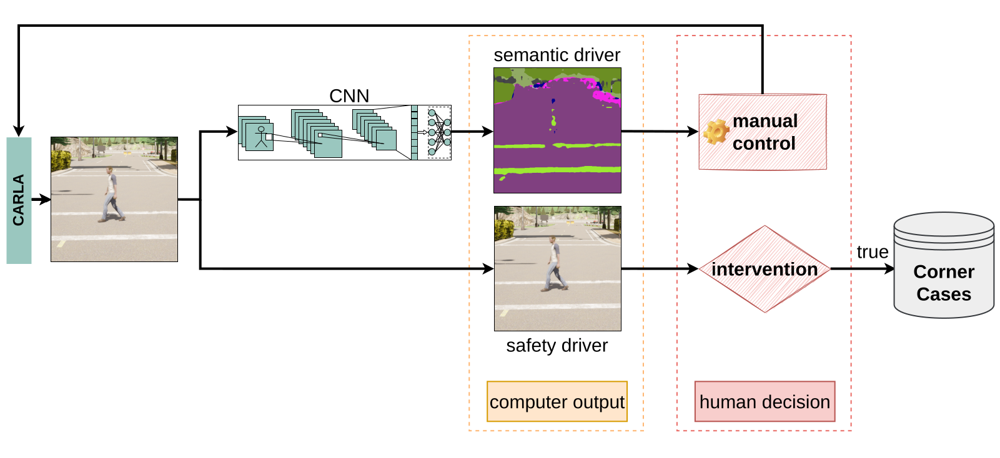

This repo is based on the CARLA 0.9.10 code and was adapted for our research (https://carla.readthedocs.io/en/0.9.10/). 
# A-Eye
This repo provides real-time driving on the output of a semantic segmentation network. Using it, a method was developed to collect synthetic corner cases, especially those that are difficult for AI algorithms to detect, in a relatively short time with the help of two human drivers. The results were published in our paper "A-Eye: Driving with the Eyes of AI for Corner Case Generation" (https://arxiv.org/abs/2202.10803)

There are 3 ways to work with this repo. 
1. For demonstration purposes using ```control.py``` . The ego-vehicle can be controlled based on the prediction of the semantic segmentation network.
2. Use ```aeye.py``` as a recording script of safety-critical corner cases according to the A-Eye approach, where two human drivers are able to control the ego-vehicle. The semantic driver sees the prediction of the segmentation network and the safety driver is supposed to intervene in the driving situation only in case of dangerous driving situations. For more information see paper.
3. Loading and saving of the corner case drives using ```save_cc.py```.



## Structure

```bash
├── models          # usable models are placed here
├── supplement      # additional scripts
├── utils           # required scripts 
└── weights         # trained model weights
```

## Installation
First you need a working CARLA 0.9.10 version on your system. For this follow the instructions on the official CARLA repo for version 10: https://carla.readthedocs.io/en/0.9.10/


It is recommended to create a python3 environment and install all required packages. Our code runs with python version 3.6
```bash
pip install --upgrade pip
pip install -r requirements.txt
```
Also you should create an output folder in your working directory:
```bash
mkdir output
```
## Run Code - Demonstration
Now you can start with the first test drive: 
```bash
python control.py
```
The keys 2-5 contain the inference sensor with 4 different weights for the Fast-SCNN. 2 represents the basis for the corner cases and 3,4,5 the trained models with the data sets original, corner cases and pedestrian enriched.

Preset weather conditions can be selected using the F5 to F8 keys (F5=clear, F6=rain, F7=fog, F8=night). 

## Run Code - Corner Case Triggering
This script requires two human drivers, each with a control unit (steering wheel, pedals, screen, seat). The script can be started as follows: 
```bash
python aeye.py
```
A GUI will appear where you can click on all the information you need. Each started trip saves a ride in the outputs folder. As soon as the safety driver intervenes, a window pops up asking whether it was actually a corner case and if so, what the reason was.

## Run Code - Corner Case Retrieval
After some corner cases drives were recorded, they can be afterwards loaded and saved for each needed sensor. For this, copy all needed recordings inside the output folder in a seperate folder named recordings. 
To do this, copy all needed recordings within the output folder to a separate folder named ```recordings```.

The script can be started as follows: 
```bash
python save_cc.py
```

## Citation
If you find our work useful for your research, please cite our paper:
```
@conference{kowol2022,
author={Kamil Kowol. and Stefan Bracke. and Hanno Gottschalk.},
title={A-Eye: Driving with the Eyes of AI for Corner Case Generation},
booktitle={Proceedings of the 6th International Conference on Computer-Human Interaction Research and Applications - CHIRA,},
year={2022},
pages={41-48},
publisher={SciTePress},
organization={INSTICC},
doi={10.5220/0011526500003323},
isbn={978-989-758-609-5},
issn={2184-3244},
}
```
